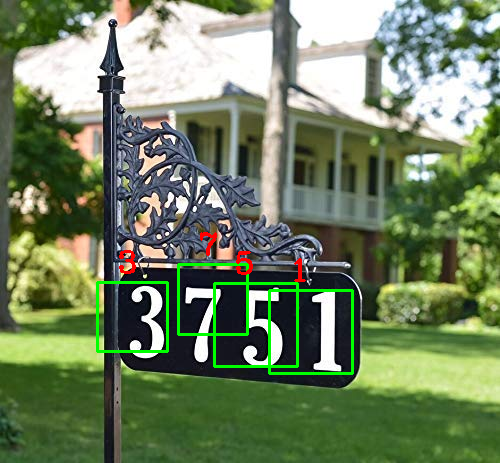
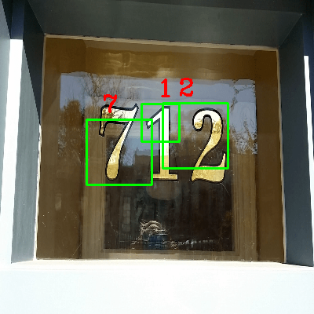

Done for OMSCS - Georgia Institute of Technology CS 6476    

**FOLDER STRUCTURE**\
<pre>
CV_CNN\
       /curves
       /datasets
       /detection_input
       /graded_images  
       /models    --not exposing
       /output
       helper.py -- not exposing
       models.py  -- not exposing
       run.py     --not exposing
       video_process.py --not exposing
	   Report.pdf
	   
</pre>

CURVES: contains accuracy and loss curves of 3 models\
DATASET: This folder should contain .h5 py train data, test data and vggdataset
             [Google Drive Link:](https://drive.google.com/open?id=1oUKKJUoXkSypbbcELq_VkuPANTJKByB_)\
DETECTION_INPUT: This folder contains .png images for grading as well video inputs\
GRADED_IMAGES:  folder contains .png images for grading\
MODELS: .h5 files of all models full 30 epochs as well as early stopping. Of which model_pretrained_early.h5 is used for classification\
OUTPUT: Contains video output

helper.py - gets the raw image and converts to train.h5 and test.h5 which is easy to be used for the model\
models.py - design training and evaluating all 3  models\
run.py - preprocesses the given input images, loads the model, employes image pyramid and sliding window to detect digits
         saves the image with bounding box\
video_process.py - Loads the model, takes in the video and calls run.py's functions to perform recognition and classification task\

  

**RUNNING INSTRUCTION**:
1. Run run.py
2. Find images in /graded_images
3. Find Video in output final_svhn.mp4
4. for training the model, download teh dataset and place in dataset folder, run models.py

LINK TO VIDEOS
DEMO VIDEO :[YouTube](https://www.youtube.com/watch?v=WoRBkeaG8Ac) or [Google Drive](https://drive.google.com/open?id=10sr37x8IRhecp-xZkKDiYQdZn94f24C8)\
PRESENTATION:  [YouTube](https://youtu.be/1EjcUxjSevA)  or [Google Drive](https://drive.google.com/file/d/1eiGsxf6Xtig8VYkolkLlaObwJX12iyt7/view?usp=sharing)\
REPORT : [here](Report.pdf)

